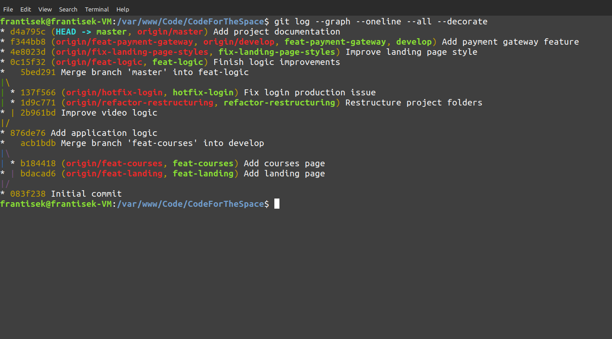

# Git Branching Exercise

A hands-on Git project demonstrating professional branching workflows, merge strategies, hotfix handling, conflict resolution, and repository restructuring.

## Overview

This repository was created as part of a Git workflow exercise simulating the development of a fictional online learning platform called **CodeForTheSpace**.

The goal was not to build software, but to learn how real development teams use Git to manage features, releases, hotfixes, and refactoring.

## Git Concepts Demonstrated

* Repository initialization
* Feature branches
* Development and production branches
* Fast-forward merges
* Merge commits
* Merge conflict resolution
* Hotfix workflows
* Refactoring using `git mv`
* Branch visualization with Git graphs

## Branches Used

* master
* develop
* feat-courses
* feat-landing
* feat-logic
* refactor-restructuring
* hotfix-login
* fix-landing-page-styles
* feat-payment-gateway

## Key Learning Outcomes

During this exercise I learned how to:

1. Isolate work using feature branches.
2. Merge completed features into a development branch.
3. Release changes into production.
4. Create emergency hotfixes directly from production.
5. Resolve merge conflicts manually.
6. Visualize and understand Git history using commit graphs.

## Git History Visualization

One of the main goals of this project was to understand how Git represents software development through branches, merges, hotfixes, and conflict resolution.

This repository demonstrates:

* Feature branch development
* Fast-forward merges
* Merge commits
* Hotfix workflows
* Refactoring branches
* Merge conflict resolution

### Generate the Git Graph

```bash
git log --graph --oneline --all --decorate
```

### Example History

```text
* Add project documentation
* Add payment gateway feature
* Improve landing page style
* Finish logic improvements
* Merge branch 'master' into feat-logic
* Fix login production issue
* Restructure project folders
* Add application logic
* Merge branch 'feat-courses' into develop
* Initial commit
```

The complete graph output is available in:

```text
docs/final-graph.txt
```

### Git Graph Screenshot

After creating a screenshot, place it in:

```text
docs/images/git-graph.png
```

and GitHub will display it here:

```markdown

```

## Useful Commands

### View branch history

```bash
git log --graph --oneline --all --decorate
```

### View repository status

```bash
git status
```

### List branches

```bash
git branch
```

### Switch branches

```bash
git checkout branch-name
```

### Create a new branch

```bash
git checkout -b branch-name
```

### Merge a branch

```bash
git merge branch-name
```

## Project Structure

```text
.
├── courses/
│   └── courses.md
├── landing/
│   └── landing.md
├── logic/
│   └── logic.md
├── payment/
│   ├── payment.md
│   ├── confirmation.md
│   └── receipt.md
├── docs/
│   ├── git-workflow.md
│   ├── branch-tree.md
│   ├── final-graph.txt
│   └── images/
└── README.md
```

## Documentation

Additional project documentation can be found in:

* `docs/git-workflow.md`
* `docs/branch-tree.md`
* `docs/final-graph.txt`

## Author

Created as a Git learning exercise demonstrating practical version control workflows.

Repository created and maintained by Frantisek B.
